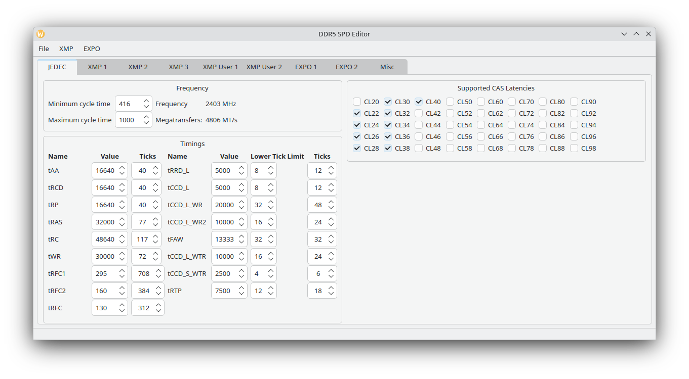

# DDR5SPDEditor
DDR5 SPD + XMP 3.0 + EXPO Editor in QT

Only for regular, non buffered/non ECC DDR5 UDIMMS/SODIMMS.

# Screenshots

# Usage
1. Dump the SPD using [SPD-Reader-Writer](https://github.com/1a2m3/SPD-Reader-Writer).
2. Open SPD dump and change settings to whatever you want.
3. Save your modified SPD.
4. Write the modified SPD using SPD-Reader-Writer if it reports a valid checksum (AT YOUR OWN RISK).

# Features
XMP 3.0
- Disable/Enable XMP header
- Wipe individual profiles/complete XMP block
- Import/Export XMP 3.0 profiles

EXPO support
- Disable/Enable EXPO header
- Create EXPO profile frome existent XMP profile
- Import/Export EXPO profiles

# TODO
- Finish Misc Tab
- Add default JEDEC profiles
- Figure out some bits that are still missing (like DIMMs per channel)
- CUDIMM support, or at least testing to make sure it doesn't corrupt the SPD.
- Fix the windows build provided by Github actions

# Acknowledgements
- N-Storm (https://github.com/N-Storm) for the Github actions
